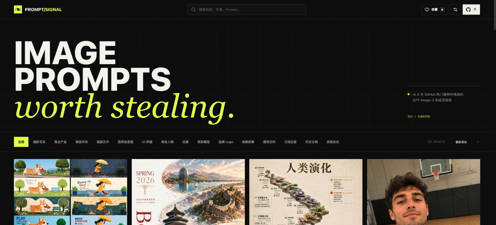

# PROMPT/SIGNAL

> A focused gallery for discovering, editing, and rendering high-signal image prompts.

<p align="center">
  <a href="https://andy7076.github.io/image_prompt/">Live demo</a>
  ·
  <a href="https://github.com/andy7076/image_prompt/blob/main/README.zh-CN.md">简体中文</a>
  ·
  <a href="https://github.com/andy7076/image_prompt/issues">Issues</a>
</p>

<p align="center">
  
  
  
</p>



PROMPT/SIGNAL turns public image-prompt references into a searchable masonry workspace. Browse a case, inspect its full prompt, edit it, attach a local reference image, and send the request to an image endpoint you control. The interface starts in English and can be switched to Chinese from the header.

## What ships

- **Masonry discovery** — natural image ratios, progressive loading, category filters, search, and newest/title/curated sorting.
- **Prompt workspace** — full prompt editing, copy-to-clipboard, source links, previous/next navigation, and image zoom.
- **Generation flow** — editable confirmation dialog, optional PNG/JPEG/WEBP reference image, generated/source switching, and download in a new tab.
- **Local archive** — favorites, model settings, language preference, and up to 30 generated results persist in the current browser only.
- **Multi-source attribution** — a case can retain multiple source URLs across GitHub, X, and other public references.
- **Static-first deployment** — no backend is required for browsing; GitHub Actions builds and deploys the site to Pages.

## Quick start

Requirements: Node.js 20+ and npm.

```bash
npm install
npm run dev
```

Open the local URL printed by Vite. For a production build:

```bash
npm run build
npm run preview
```

## Connect an image provider

Open **Image model settings** in the top-right corner. The form is intentionally provider-neutral: enter the exact URL, key, and model identifier supplied by your gateway or image service.

| Field | What to enter | Example |
| --- | --- | --- |
| `API URL` | The complete image-generation endpoint | `https://gateway.example/v1/images/generations` |
| `API KEY` | The bearer token issued by your service | `sk-...` |
| `MODEL` | The exact model name accepted by the endpoint | `gpt-image-2` |
| `SIZE` | Output size; `auto` is the default | `auto` |
| `QUALITY` | Output quality; `auto` is the default | `auto` |

### Gateway and proxy rules

PROMPT/SIGNAL sends requests directly from the browser. Your endpoint therefore needs browser CORS permission for the site origin and must accept an `Authorization: Bearer <key>` header.

- If your service gives you a base URL, append its image route, usually `/v1/images/generations`.
- When a reference image is attached, the app derives the edit route by replacing the trailing `/generations` with `/edits`.
- If your gateway uses a different edit path, configure that final edit URL as the API URL or add a small compatibility route in your gateway.
- Never commit a production key. Settings are stored in `localStorage` and are never bundled into the repository, but a browser can still access the key while you use the page.

The text-only request is equivalent to:

```http
POST /v1/images/generations
Authorization: Bearer <API_KEY>
Content-Type: application/json
```

```json
{
  "model": "gpt-image-2",
  "prompt": "Your edited prompt",
  "size": "auto",
  "quality": "auto",
  "n": 1
}
```

For a reference image, the app submits `multipart/form-data` with `image`, `model`, `prompt`, `size`, `quality`, and `n` fields. The response should expose either `data[0].url` or `data[0].b64_json`.

## Use the workspace

1. Search or filter the gallery to find a reference.
2. Open a case and edit the prompt directly in the detail panel.
3. Optionally upload a local reference image, then review both prompt and reference in the confirmation dialog.
4. Confirm generation. The result is recorded in **Generation history**.
5. Reopen a previous result from the history panel to copy its prompt, download the image, or render another variation.

The language switch is in the header. English is the default for new visitors; the preference is remembered locally.

## Data and attribution

The gallery combines curated material from:

- [`freestylefly/awesome-gpt-image-2`](https://github.com/freestylefly/awesome-gpt-image-2)
- [`wuyoscar/GPT-Image2-Skill`](https://github.com/wuyoscar/GPT-Image2-Skill)
- Public X posts and creator references

Prompt text, images, names, and trademarks remain subject to their original authors and licenses. Check the source and obtain permission before commercial use. Corrections and additional source URLs are welcome through an issue or pull request.

## Project structure

```text
src/App.jsx                 React UI, i18n, interactions, and generation flow
src/styles.css              Design system, responsive layout, and motion
src/data.js                 Curated cases, categories, and source metadata
src/cases.generated.json    GitHub-derived prompt records
src/zhidawang.generated.json X-derived prompt records
public/images/              Gallery assets and README screenshots
.github/workflows/          GitHub Pages deployment
```

## GitHub Pages

Pushes to `main` trigger [`.github/workflows/deploy-pages.yml`](./.github/workflows/deploy-pages.yml). The public build is available at:

**[andy7076.github.io/image_prompt](https://andy7076.github.io/image_prompt/)**

## Contributing

Please include the original public URL, attribution details, and a short explanation of any prompt or metadata change. Keep generated data deterministic and run `npm run build` before opening a pull request.

## License

The application code has no separate license file yet. Images, prompts, brands, and third-party materials follow the rights and terms of their respective sources.

<p align="center"><sub>Built for people who collect references, not just likes.</sub></p>
