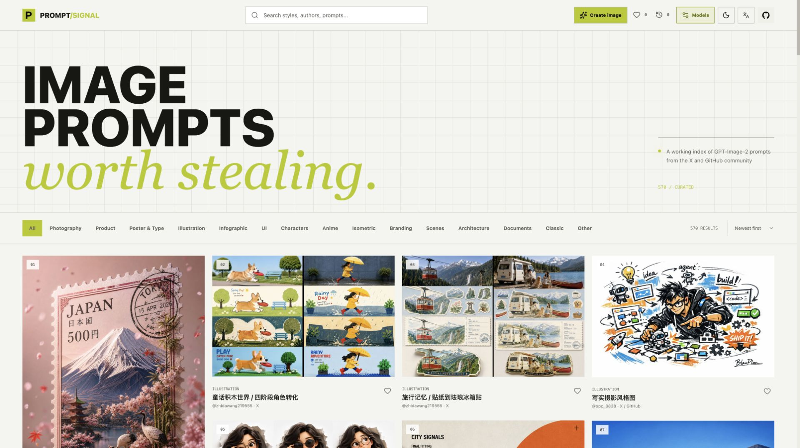
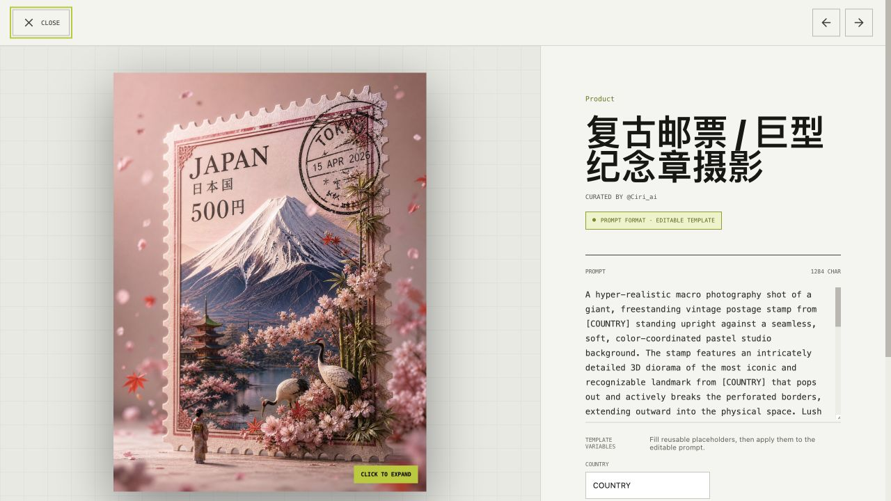
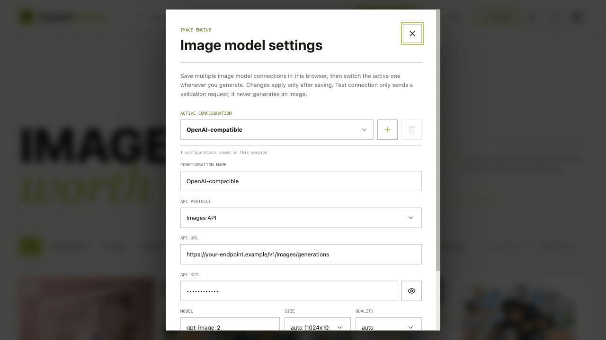
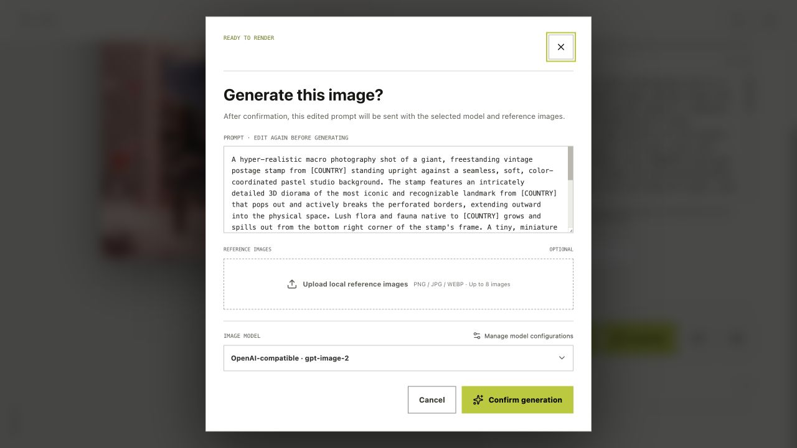
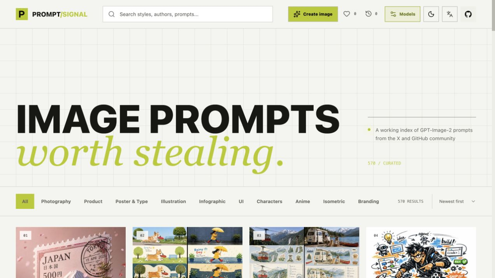

# PROMPT/SIGNAL

> 一个用于发现、编辑和生成高质量图片 Prompt 的视觉案例库。

<p align="center">
  <a href="https://andy7076.github.io/image_prompt/">在线体验</a>
  ·
  <a href="https://linux.do">LINUX DO 社区</a>
  ·
  <a href="https://github.com/andy7076/image_prompt/blob/main/README.md">English</a>
  ·
  <a href="https://github.com/andy7076/image_prompt/issues">反馈问题</a>
</p>

<p align="center">
  
  
  
  
</p>



PROMPT/SIGNAL 将公开社区中的高质量图片 Prompt 整理成可搜索、可编辑、可直接生成的工作台。浏览案例、查看原始文本、调整模板变量、上传参考图、选择模型，并在当前案例中完成生成。

## 核心能力

| 能力 | 说明 |
| --- | --- |
| 精准瀑布流 | 使用真实图片宽高和贪心最短列算法，保留原始比例，加载时稳定占位，避免跳动。 |
| Prompt 工作台 | 编辑完整 Prompt，提取并修改模板变量，复制、恢复原文、查看多出处来源，并支持图片放大。 |
| 生成工作台 | 支持自定义 Prompt、最多 8 张本地参考图、模型切换、生成前确认和新标签页下载。 |
| 多模型 Profile | 保存多套 Images API 或 GenerateContent API 配置，在生成前自由切换。 |
| 本地记录 | 收藏、语言与主题偏好，以及最多 30 条生成结果保存在当前浏览器。 |
| 多出处归档 | 同一案例可关联 GitHub、X 等多个公开来源。 |

## 界面预览

<table>
  <tr>
    <td></td>
    <td></td>
  </tr>
  <tr>
    <td align="center"><sub>编辑案例与可复用变量</sub></td>
    <td align="center"><sub>保存并切换本地模型配置</sub></td>
  </tr>
  <tr>
    <td></td>
    <td></td>
  </tr>
  <tr>
    <td align="center"><sub>确认最终 Prompt 和参考图</sub></td>
    <td align="center"><sub>浏览完整 Prompt 案例库</sub></td>
  </tr>
</table>

## 精选案例

从这几条最能体现案例库表现力的 Prompt 开始探索。点击图片即可打开在线详情页，继续编辑变量、上传参考图并生成。

<table>
  <tr>
    <td width="20%"><a href="https://andy7076.github.io/image_prompt/?prompt=x-zhidawang-travel-memory"></a></td>
    <td width="20%"><a href="https://andy7076.github.io/image_prompt/?prompt=x-zhidawang-lego-storybook"></a></td>
    <td width="20%"><a href="https://andy7076.github.io/image_prompt/?prompt=x-hot-ciri-stamp-macro"></a></td>
    <td width="20%"><a href="https://andy7076.github.io/image_prompt/?prompt=case-30"></a></td>
    <td width="20%"><a href="https://andy7076.github.io/image_prompt/?prompt=case-32"></a></td>
  </tr>
  <tr>
    <td align="center"><sub>旅行记忆</sub></td>
    <td align="center"><sub>积木绘本</sub></td>
    <td align="center"><sub>邮票微距</sub></td>
    <td align="center"><sub>写实摄影</sub></td>
    <td align="center"><sub>插画创作</sub></td>
  </tr>
</table>

## 快速开始

需要 Node.js 20+ 和 npm。

```bash
npm install
npm run dev
```

打开 Vite 输出的本地地址即可。提交修改前建议运行：

```bash
npm run check              # 校验案例数据并执行构建检查
npm run build              # 构建生产版本
npm run preview            # 预览生产构建
npm run extract:dimensions # 刷新本地图片尺寸元数据
```

## 配置图片模型

点击右上角的 **Models**，添加或选择一个 Profile 后保存。配置表单不绑定任何特定服务商，只需填写接口文档中对应的协议、地址、密钥和模型标识。首次访问时 URL、Key、Model 均为空，`SIZE` 和 `QUALITY` 默认 `auto`。

| 字段 | 填写内容 |
| --- | --- |
| `API PROTOCOL` | OpenAI 兼容图片路由选择 `Images API`；Gemini 风格路由选择 `GenerateContent API`。 |
| `API URL` | Images API 的完整图片路由，或 GenerateContent API 的基础地址。 |
| `API KEY` | 该接口要求的访问令牌，只保存在当前浏览器。 |
| `MODEL` | 接口文档中要求的精确模型名。 |
| `SIZE` | `auto`、`1024x1024`、`1536x1024`、`1024x1536`、`1792x1024` 或 `1024x1792`。 |
| `QUALITY` | Images API 可选 `auto`、`standard` 或 `hd`。 |

**Test connection** 只发送校验请求，不会真正生成图片。400/415/422 表示接口可达但校验载荷被拒绝，会显示为提示；明确的 401/403 鉴权失败或 404 路由/模型不存在才会标记为错误。网络、CORS、限流和服务端参数校验问题会保留为可读的警告，避免把可用网关误判为不可用。

### 浏览器与网关要求

请求直接从浏览器发出，因此接口必须允许当前网站来源的 CORS。Images API 使用 `Authorization: Bearer <key>`；GenerateContent API 使用 `x-goog-api-key`。

Images API 的纯文本请求示例：

```http
POST /v1/images/generations
Authorization: Bearer <API_KEY>
Content-Type: application/json
```

```json
{
  "model": "your-model",
  "prompt": "你编辑后的 Prompt",
  "size": "1024x1024",
  "quality": "standard",
  "n": 1
}
```

上传参考图后，应用会将末尾的 `/generations` 自动替换为 `/edits`，并以 `multipart/form-data` 发送。单张图片字段为 `image`，多张图片字段为 `image[]`。接口需要在响应中返回 `data[0].url` 或 `data[0].b64_json`。

GenerateContent API 需要填写基础 URL 和模型名。应用会自动拼接 `/models/{model}:generateContent`，将 Prompt 与参考图作为 content parts 发送，并从响应的 inline image data 中读取生成结果。

> 不要将生产环境 API Key 提交到 Git。浏览器本地存储适合个人使用；面向多人部署时，建议增加服务端代理隐藏密钥并统一处理 CORS。

## 使用流程

1. 搜索或筛选画廊，打开一个案例。
2. 直接编辑 Prompt，或修改提取出的模板变量并应用。
3. 按需上传最多 8 张 PNG、JPEG 或 WEBP 参考图。
4. 点击 **Generate**，在确认窗口中检查 Prompt、参考图和模型后提交。
5. 在 **Generation history** 中查看结果，可复制 Prompt、下载图片或再次生成。

顶部可以切换英文/中文和亮色/暗色主题。偏好设置只保存在当前浏览器。

## 数据与署名

案例主要整理自：

- [`freestylefly/awesome-gpt-image-2`](https://github.com/freestylefly/awesome-gpt-image-2)
- [`wuyoscar/GPT-Image2-Skill`](https://github.com/wuyoscar/GPT-Image2-Skill)
- X 上公开的案例与创作者内容

每条案例保留公开来源地址、署名信息和规范化后的 Prompt 文本。Prompt、图片、商标和作者名称仍受原始权利人及其许可条款约束，商业使用前请自行核验授权。欢迎通过 Issue 或 Pull Request 提交新案例、来源修正和数据纠错。

## 项目结构

```text
src/App.jsx                 React UI、国际化、主题、Profile 与生成流程
src/styles.css              视觉系统、响应式布局与动效
src/data.js                 分类、精选案例和数据归一化
src/*.generated.json        案例 Prompt、图片和来源元数据
public/images/              画廊素材与 README 截图
scripts/                    案例校验和图片尺寸工具
.github/workflows/          GitHub Pages 自动部署
```

## GitHub Pages

推送到 `main` 会触发 [`.github/workflows/deploy-pages.yml`](./.github/workflows/deploy-pages.yml) 构建并发布到：

**[andy7076.github.io/image_prompt](https://andy7076.github.io/image_prompt/)**

## 贡献规范

提交案例时请附公开原始链接、署名信息以及 Prompt 或元数据的修改说明。修改后请先运行 `npm run check`。

## 开源协议

应用代码基于 [MIT License](./LICENSE) 协议开源。第三方图片、Prompt 文本、商标及作者署名信息遵循各自原始作者和平台的权利条款。

<p align="center"><sub>Open prompts. Real references. A faster path from idea to image.</sub></p>
